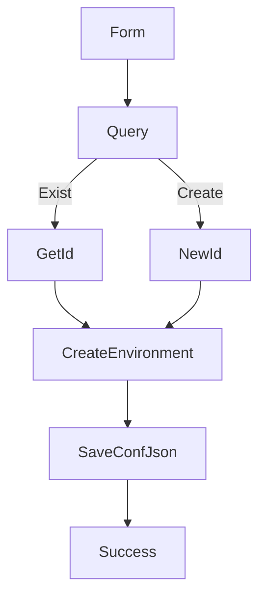
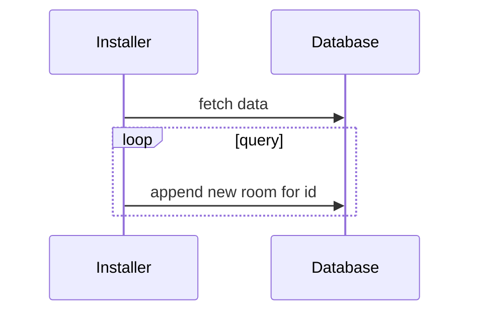

## Structure

```mermaid
graph TD
Form-->Query--Exist-->GetId-->CreateEnvironment
Query--Create-->NewId-->CreateEnvironment-->SaveConfJson-->Success
```

### Query

```mermaid
sequenceDiagram
Installer ->> Database : fetch data
loop query
	Installer ->> Database : append new room for id
end
```

