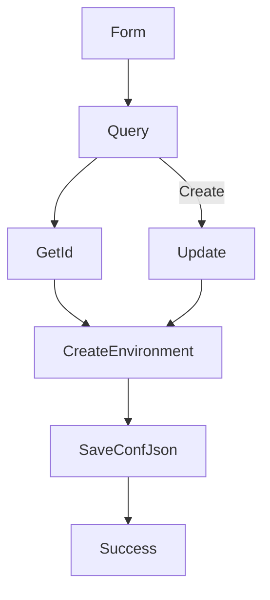
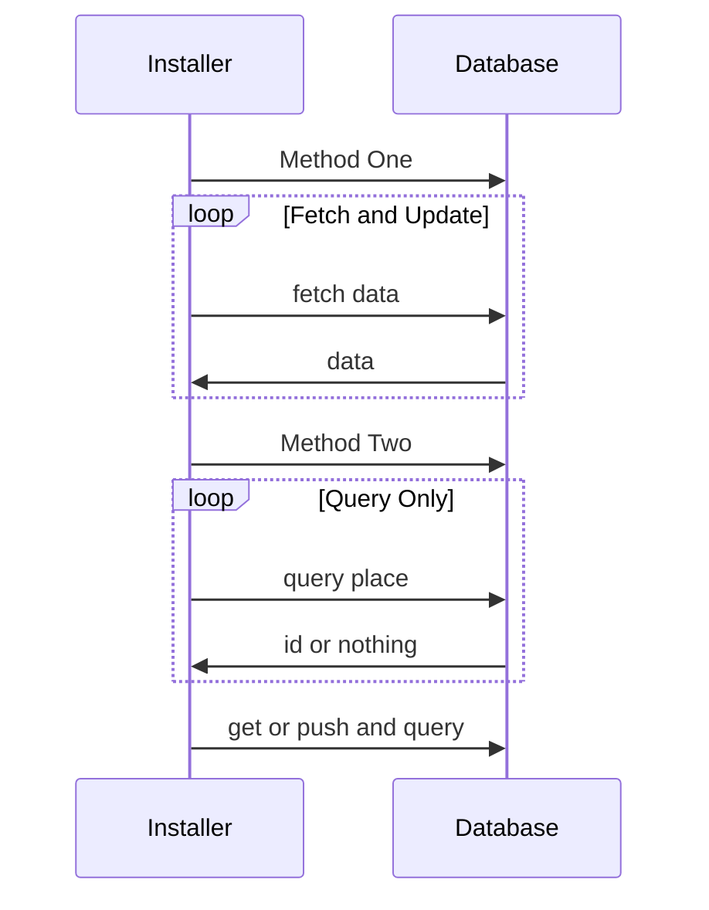

## Structure

```mermaid
graph TD
Form-->Query-->GetId-->CreateEnvironment
Query--Create-->Update-->CreateEnvironment-->SaveConfJson-->Success
```

### Query

```mermaid
sequenceDiagram
Installer ->> Database : Method One
loop Fetch and Update
	Installer ->> Database : fetch data
	Database ->> Installer : data
end
Installer ->> Database : Method Two
loop Query Only
	Installer ->> Database : query place
	Database ->> Installer : id or nothing
end
Installer ->> Database : get or push and query
```

-   [x] method one
-   [ ] method two